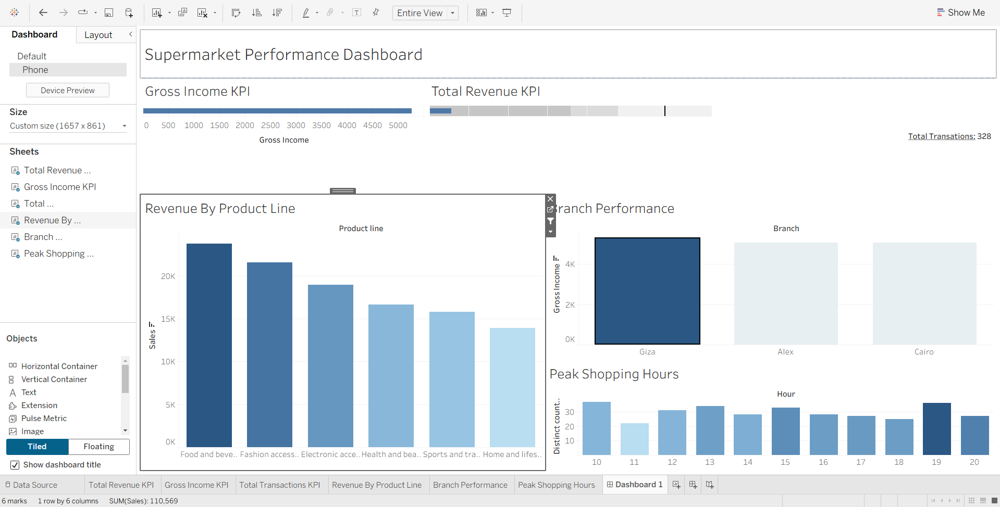

# Supermarket Performance & Customer Behavior Dashboard

## 📊 Project Overview

This project analyzes transactional data from a three-branch supermarket chain to identify key performance drivers, understand customer behavior, and provide data-driven recommendations. The final output is a dynamic, interactive business intelligence dashboard built in Tableau.

---

## 📈 Final Dashboard

 

---

## 🔑 Key Insights & Findings

Through exploratory data analysis, several key insights were uncovered:

* **Branch Performance:** Branch C generates the highest gross income, indicating higher-value purchases or better margins, despite Branch A having the most transactions.
* **Peak Hours:** The busiest shopping period is in the early afternoon (12 PM - 3 PM), suggesting that staffing and promotions should be focused on this window.
* **Popular Product Lines:** "Fashion accessories" and "Food and beverages" are the most frequently sold product lines, making them crucial for driving foot traffic.
* **Payment Methods:** E-wallet is the most popular payment method, highlighting a trend towards digital payments among customers.

---

## 🛠️ Tools Used

* **Python:** For data cleaning and feature engineering.
    * **Pandas:** Data manipulation and analysis.
    * **Matplotlib / Seaborn:** Initial exploratory data visualization.
* **Tableau:** For creating the interactive BI dashboard.
* **Jupyter Notebook:** For developing and documenting the analysis steps.

---

## 🚀 How to Use

1.  **Clone the repository:**
    ```bash
    git clone [https://github.com/your-username/your-repo-name.git](https://github.com/your-username/your-repo-name.git)
    ```
2.  **Run the analysis notebook:**
    The `notebooks` folder contains the Jupyter Notebook with the full Python analysis.
3.  **View the interactive dashboard:**
    A packaged Tableau workbook (`.twbx`) can be opened with Tableau Reader or Tableau Desktop to explore the live dashboard. *(You can save your workbook as a .twbx file from Tableau to include it in the project)*.
